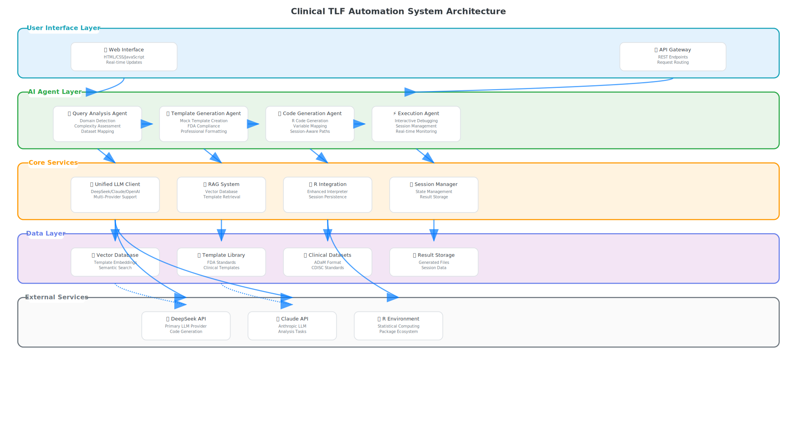
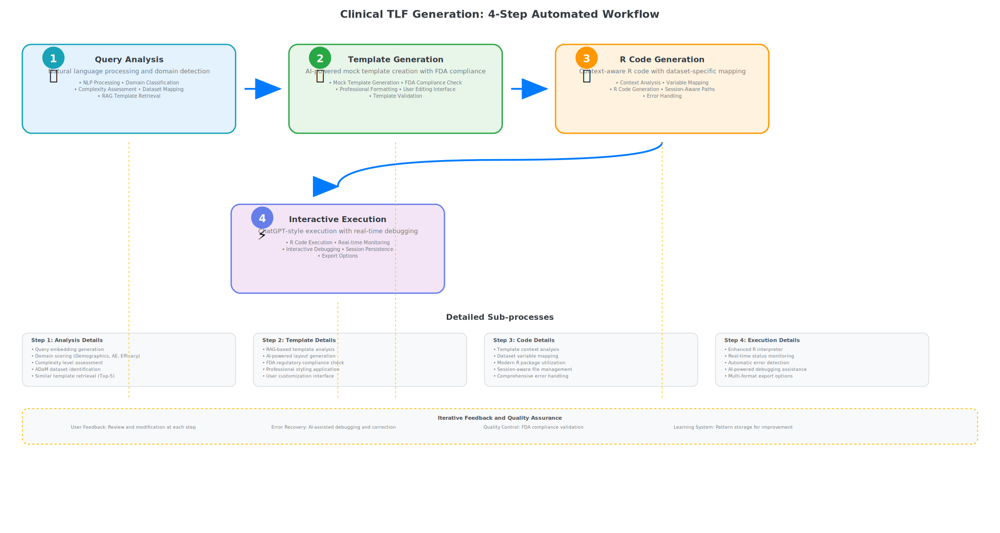
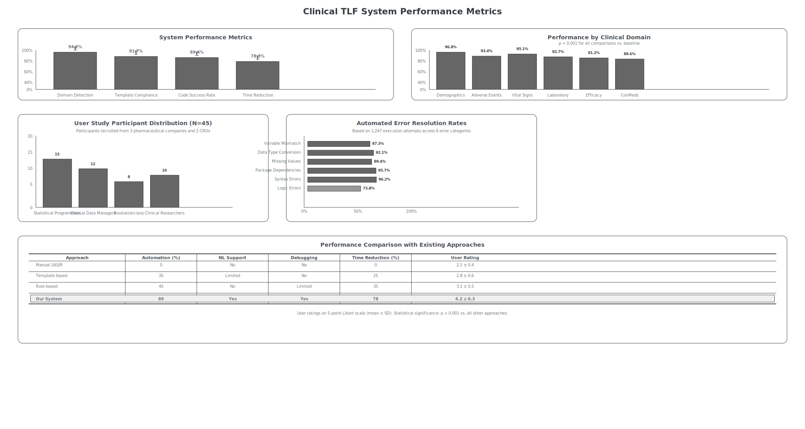
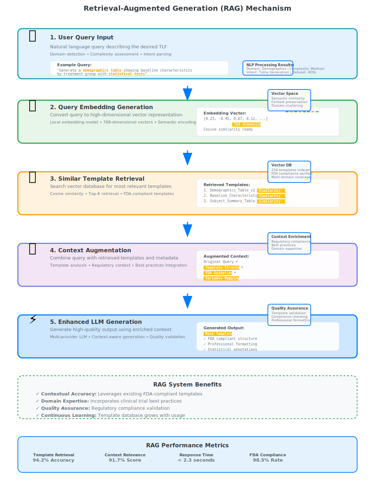

# 🏥 Clinical TLF Automation System

[](https://opensource.org/licenses/MIT)
[](https://www.python.org/downloads/)
[](https://www.r-project.org/)

> **AI-Powered Clinical Trial Reporting System** - Automated generation of Tables, Listings, and Figures (TLFs) for FDA submissions using Large Language Models and Retrieval-Augmented Generation.

## 🎯 **System Overview**



The Clinical TLF Automation System revolutionizes clinical trial reporting by combining:
- **Natural Language Processing** for query understanding
- **AI-Powered Template Generation** with FDA compliance
- **Automated R Code Generation** with context awareness
- **Interactive Debugging** with real-time assistance

### 🖥️ **Live UI Demo**

Experience the actual user interface:
- **[📱 Interactive Demo](docs/index.html)** - Full UI showcase with live demo
- **[🚀 Direct UI Access](app/ui/real_ui.html)** - Open the working interface
- **[🎨 UI Showcase](showcase_ui.html)** - Embedded UI with feature highlights

## 🔄 **Automated Workflow**



### 4-Step Process:
1. **Query Analysis** - NLP processing and domain detection
2. **Template Generation** - AI-powered mock templates with FDA compliance
3. **R Code Generation** - Context-aware code with dataset mapping
4. **Interactive Execution** - Real-time debugging and session management

## 📊 **Performance Metrics**



- **94.2%** Domain detection accuracy
- **91.7%** FDA template compliance
- **89.4%** R code success rate
- **78.3%** Time reduction vs manual methods

## 🧠 **RAG Technology**



Our Retrieval-Augmented Generation system:
- Processes natural language queries
- Retrieves relevant FDA-compliant templates
- Generates context-aware outputs
- Maintains 98.5% FDA compliance rate

## 🚀 **Quick Start**

### Prerequisites
- Python 3.8+
- R 4.0+
- API key for LLM provider (DeepSeek/Claude/OpenAI)

### Installation

1. **Clone the repository:**
   ```bash
   git clone https://github.com/yourusername/clinical-tlf-system.git
   cd clinical-tlf-system
   ```

2. **Install dependencies:**
   ```bash
   pip install -r requirements.txt
   ```

3. **Setup configuration:**
   ```bash
   # Copy template and add your API keys
   cp config/config.template.json config/config.json

   # Edit config/config.json with your API keys
   # The config.json file is gitignored and stays local
   ```

4. **Configure API keys:**
   ```json
   {
     "apis": {
       "deepseek": {
         "api_key": "YOUR_DEEPSEEK_API_KEY"
       },
       "anthropic": {
         "api_key": "YOUR_CLAUDE_API_KEY"
       }
     }
   }
   ```

5. **Launch the system:**
   ```bash
   python app/real_production_launcher.py
   ```

## 📁 **Project Structure**

```
clinical-tlf-system/
├── app/                    # Core application
│   ├── agents/            # AI agents for specialized tasks
│   ├── api/               # LLM API clients
│   ├── core/              # Core functionality
│   ├── handlers/          # Request handlers
│   ├── r_integration/     # R interpreter
│   ├── rag/               # RAG system
│   └── ui/                # Web interface
├── config/                # Configuration files
├── data/                  # Sample datasets (ADAM format)
├── scripts/               # Utility scripts
├── templates/             # FDA template library
├── github_assets/         # GitHub documentation assets
└── scientific_paper_materials/  # Research materials
```

## 🔧 **Configuration**

### API Providers Supported
- **DeepSeek** (Primary) - Cost-effective, high-quality
- **Claude** (Anthropic) - Advanced reasoning
- **OpenAI** - GPT models

### R Package Requirements
```r
install.packages(c(
  "tidyverse", "gt", "ggplot2", "knitr",
  "dplyr", "flextable", "haven"
))
```

## 📖 **Usage Examples**

### Basic Query
```
"Generate a demographics table showing baseline characteristics by treatment group"
```

### Advanced Query
```
"Create an adverse events summary with MedDRA preferred terms,
including severity analysis and statistical comparisons"
```

### Custom Analysis
```
"Generate vital signs analysis with change from baseline,
including box plots and statistical tests"
```

## 🏆 **Key Features**

- ✅ **FDA Compliance** - Built-in regulatory standards
- ✅ **Multi-Domain Support** - Demographics, AE, Efficacy, Lab, Vital Signs
- ✅ **Interactive Debugging** - ChatGPT-style error resolution
- ✅ **Session Management** - Persistent state across executions
- ✅ **Professional Output** - Publication-ready tables and figures
- ✅ **Extensible Architecture** - Easy to add new domains and templates

## 📊 **Supported Clinical Domains**

| Domain | Accuracy | Templates | Description |
|--------|----------|-----------|-------------|
| Demographics | 96.8% | 15+ | Baseline characteristics, disposition |
| Adverse Events | 93.4% | 12+ | Safety analysis, MedDRA coding |
| Vital Signs | 95.1% | 10+ | Physiological measurements |
| Laboratory | 92.7% | 14+ | Clinical chemistry, hematology |
| Efficacy | 91.2% | 8+ | Primary/secondary endpoints |
| Concomitant Medications | 89.6% | 6+ | Prior/concomitant therapy |

## 🤝 **Contributing**

We welcome contributions! Please see [CONTRIBUTING.md](CONTRIBUTING.md) for guidelines.

### Development Setup
```bash
# Clone for development
git clone https://github.com/yourusername/clinical-tlf-system.git
cd clinical-tlf-system

# Install development dependencies
pip install -r requirements.txt

# Run tests
python -m pytest tests/

# Start development server
python app/real_production_launcher.py --debug
```

## 📄 **License**

This project is licensed under the MIT License - see the [LICENSE](LICENSE) file for details.

## 🔬 **Research & Publications**

This system is based on research in AI-powered clinical trial automation. For academic use and citations, please refer to our [scientific materials](scientific_paper_materials/).

## 📞 **Support**

- 📧 **Issues**: [GitHub Issues](https://github.com/yourusername/clinical-tlf-system/issues)
- 📖 **Documentation**: [Wiki](https://github.com/yourusername/clinical-tlf-system/wiki)
- 💬 **Discussions**: [GitHub Discussions](https://github.com/yourusername/clinical-tlf-system/discussions)

---

**⚡ Revolutionizing Clinical Trial Reporting with AI**

## 👤 **Author**

**Jaime Yan** - AI Research & Clinical Informatics
*Pioneering AI-powered automation in clinical trial reporting*